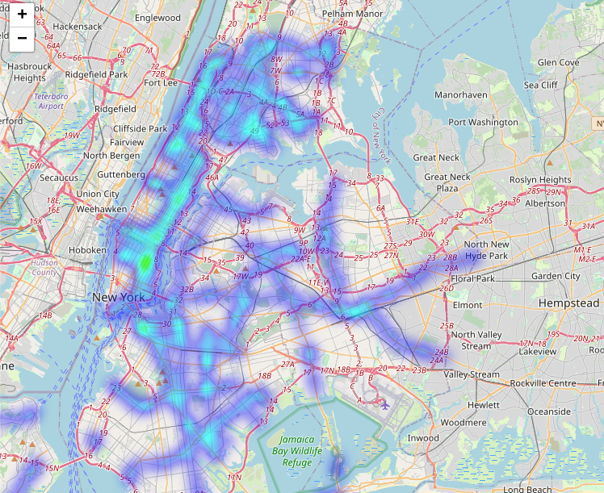
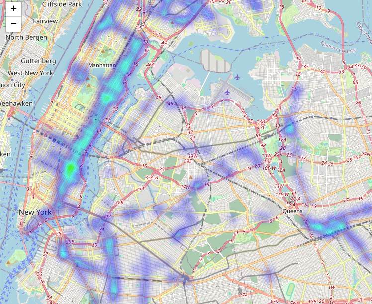
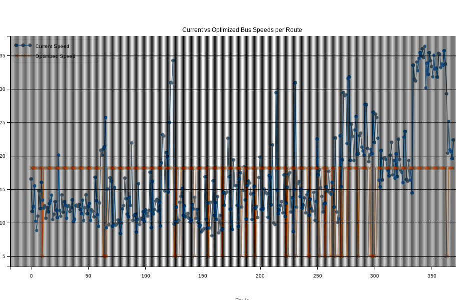

TO begin, we accessed the data via odata from the MTA database site. Through chunking, we fetched the relevant datasets to use to
answer the business questions. Since each dataset contains millions of entries, we sampled 1% from each dataset randomly to simplify the
computational process while maintaining the integrity of our analysis as each sample would still contain tens of thousands of entries.

Violations Heatmap

Violations heatmap before the implementation of congestion pricing policy

Violations heatmap after the implementation of congestion pricing policy
![violations_after_cbd(violations_after_cbd.png)

In the violation occurrences heatmaps, there is a stark difference between the before and after of the congestion pricing policy.
In the before, we notice concentrated areas in lower Manhattan and the Bronx. However, in the after, we noticed
how the blue violations region gets spread out more evenly and is far less concentrated through the city.

Repeat exempt violators before the implementation of ace

Repeat exempt violators after the implementation of ace

In comparing the before and after the implementation of the ACE program, we notice the repeat exempt violation occurrences also gets a 
change in how much thinner the blue is spread out.

Then, we performed a difference in differences analysis as well as a T-test to test our hypothesis of whether or not the
implementation of cameras had any effect on the number of violation occurrences. Since each route has a different ACE implementation time,
we split the dataset using this parameter, specific to each route. Interestingly, the number of violations
actually increased by 60 (relative to our 1% sample) per day from pre to post-ACE. This has a p-value of 1.0e-114, which
is very statistically significant. This increase is likely due to the fact that having cameras increases the number of violations
being reported while the true number may have actually decreased as no one was there to measure those statistics pre-ACE.

The further deepen our analysis, we performed a convex optimization given key parameters to optimize for average bus speed spanning across
the fleet. 

First, we calculated a lower bound for the fleet size by lining up the timestamps and assuming where there is a 30 minute gap
to separate the end of a trip from stop A to stop B. By flagging when a bus has "started" its trip vs "ended", we could find out the maximum
number of active buses throughout the entire dataset at any given time. However, this estimation is just a lower bound as there is no
bus ID parameter to help us distinguish between buses, and a bus may continue from completing stop B to keep going onto stop C. Hence, when a trip
gets flagged as "ended", the bus may still be active. However, the final number we got given our calculations was roughly ~1100 active fleet size.
This makes sense given that the official number reported on the MTA website is 5700, which accounts for extra buses in the case of maintenance and repair.
Given that our estimate of 1100 is a lower bound, the true active fleet size is still within the number the MTA reports. However,
this data gives us insights into the fact that maximum active fleet at any given time is still far less than 5700, suggesting potential for 
optimization as this many buses may not even be necessary to maintain the same level of quality of transit service.

After the estimation of the fleet size, we identified a few key parameters that would be necessary for our convex optimization model.
These are: free flow speed, congestion coefficient, passenger capacity, and headway (the wait time between buses).

To start off with passenger capacity, there is no relevant data in our dataset that quantifies the number of people riding a bus. So,
we approximated this by assuming each person taking 3 seconds to board a bus and using this assumption and how long a bus stays at a stop before
departing to estimate the passenger capacity of any bus route at any given stop. Free flow speed was relatively easy to calculate as the
average travel speed is given as a parameter in the dataset, so we simply take the 95th percentile to discard any outliers to find the speed of the
bus without congestion or traffic. Calculating headway and the congestion coefficients were relatively difficult / near impossible. As the dataset includes
all bus trips between stops for all bus routes since the dataset's creation. Thus, without a bus ID parameter, we cannot distinguish between the trips
of multiple buses along the same route. We attempted to calculate the congestion coefficient by fitting a curve to describe the relationship
between free flow speed and headway as the idea is that the free flow speed would drop due to congestion, which could be captured in headway as
the more traffic there is, the closer the vehicles bunch together. However, since we were unable to make meaningful progress on headway quantification,
we decided to ignore the congestion coefficient as it would be a meaningless variable.

Finally, we performed the convex optimization and we were given a set of optimized speeds with these following fixed parameters: general headway of 5 minutes, 
a maximum fleet of 1100, and 100,000 total feet covered per route. The result was the following diagram. We notice that the optimization model sets
a few routes to the maximum speed while the others are set to the minimum. This is a corner solution to the convex optimization problem and it could not
find an optimized solution that is in the middle. However, this gives us insights as some routes go much faster than this maximum speed
while others are much slower. Thus, it points out to the fact that the routes constrained by this max speed may benefit from increase buses running along
that route or a more relaxed headway.

Current vs optimized road speeds

